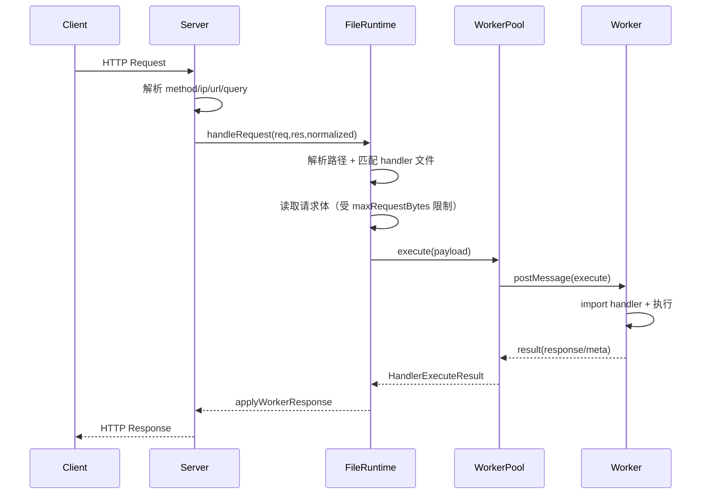

# Fluxion 系统介绍（当前实现）

## 1. Fluxion 是什么

Fluxion 是一个基于 `node:http` 的动态文件路由服务器：

- 以目录作为“运行时路由源”（`dir`）
- 支持 `.mjs` 动态 handler 与静态文件并存
- 通过 worker 线程隔离执行 handler，并提供重启、自恢复、限流、内存保护
- 提供元信息 API 便于观测路由和 worker 状态

它的目标是：用“文件即路由”的方式快速承载中小型动态服务，并保持较强的运行时安全边界。

---

## 2. 最小配置

```ts
import { fluxion } from '@/core/server.js';

fluxion({
  dir: './dynamicDirectory',
  host: '127.0.0.1',
  port: 3000,
});
```

可选配置（当前版本）：

- `databases?: (string | { name: string })[]`
- `workerStrategy?: 'all' | Array<{ id: string; db: string[]; ...workerOptions }>`
- `workerOptions?: Partial<ExecutorOptions>`
- `maxRequestBytes?: number`（请求体上限，超限返回 `413`）

---

## 3. 目录与路由规则

### 3.1 动态 handler 映射

以 `dir` 为根目录：

- `/` -> `index.mjs`
- `/aaa/bb/cc` -> 优先 `aaa/bb/cc/index.mjs`，其次 `aaa/bb/cc.mjs`

handler 导出支持两种形式：

1) 直接函数：
```js
export default function handler(req, res) {
  res.end('ok');
}
```

2) 对象形式（带 db 元信息）：
```js
export default {
  db: ['main'],
  handler(req, res, context) {
    res.end(context.worker.id);
  },
};
```

`context` 当前包含：

- `context.db`: handler 声明 db 的占位对象
- `context.hasDb(name)`
- `context.worker`: `{ id, dbSet }`

### 3.2 静态文件

当动态 handler 未命中时，尝试静态文件回退（仅 `GET`/`HEAD`）：

- 例如 `/assets/app.js` -> `assets/app.js`
- `.mjs` 不作为静态文件返回

### 3.3 安全规则

- 路径解析会拒绝 `..`、反斜杠、非法编码
- 任一路径段以 `_` 开头视为私有，不参与路由（动态与静态都屏蔽）

---

## 4. 架构总览

```mermaid
flowchart LR
  Client[HTTP Client] --> Server[Fluxion Server\ncore/server.ts]

  Server -->|GET /_fluxion/*| MetaAPI[Meta API\ncore/meta-api.ts]
  Server -->|Normal Request| Runtime[File Runtime\nworkers/file-runtime.ts]

  Runtime -->|route scan/resolve| FS[(Dynamic Directory)]
  Runtime -->|execute/inspect| Pool[Handler Worker Pool\nworkers/handler-worker-pool.ts]
  Pool --> Worker[Worker Thread\nworkers/handler-worker.ts]
  Worker --> Modules[.mjs Handler Modules]

  MetaAPI --> Routes[/_fluxion/routes]
  MetaAPI --> Health[/_fluxion/healthz]
  MetaAPI --> Workers[/_fluxion/workers]
```

---

## 5. 请求处理时序



说明：

- callback/定时器风格 handler 现在会等待 `res.finish`，避免“提前结束响应”
- worker 执行超时、内存超限、版本不一致会触发 worker 重启

---

## 6. Worker 路由策略（`workerStrategy`）

默认 `all`：

- 仅一个 worker（`fluxion-worker-all`），可访问全部声明 db

自定义策略：

- 可声明多个 worker 及其 `db` 能力集
- 运行时按“最小可满足集合”选择 worker
- 若未显式提供全量 db worker，会自动补一个 fallback all-db worker

选择优先级：

1. 能满足 handler `db` 要求
2. `dbSet` 更小优先（更精确）
3. inflight 更少优先
4. worker id 字典序兜底

---

## 7. 保护机制与错误语义

### 7.1 请求/响应体保护

- `maxRequestBytes`：限制请求体大小，超限 -> `413`
- `workerOptions.maxResponseBytes`：限制单次 handler 响应大小，超限 -> `500`（内部错误）

### 7.2 Worker 保护

- `requestTimeoutMs`：执行超时保护
- `maxInflight`：并发上限
- `memorySoftLimitMb` / `memoryHardLimitMb`：内存软硬阈值
- `maxOldGenerationSizeMb` / `maxYoungGenerationSizeMb` / `stackSizeMb`：V8 资源限制

---

## 8. 观测接口

当前 Meta API（仅 `GET`）：

- `/_fluxion/routes`：动态/静态路由快照
- `/_fluxion/healthz`：健康检查
- `/_fluxion/workers`：worker 诊断快照

说明：当前实现不包含 upload 接口。

---

## 9. 日志风格

系统日志采用两类：

- one-line：便于本地快速阅读
- jsonl：便于结构化采集

常见事件：

- `request_received` / `request_completed` / `request_failed`
- `runtime_worker_started` / `runtime_worker_restarted`
- `handler_loaded` / `handler_reloaded`

---

## 10. 适用边界与建议

适合：

- 文件驱动路由、快速迭代的后端服务
- 需要 worker 隔离和可观测性的中小系统

建议：

- 明确配置 `maxRequestBytes` 与 `maxResponseBytes`
- 对业务 handler 统一约束：必须显式结束响应
- 使用 `/_fluxion/workers` 持续观察重启原因与内存曲线
